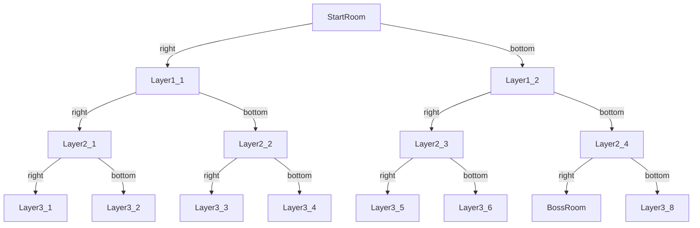

# **Team SAVE MY LINEAR ALGEBRA**

## **Membership Information**
    1. 潘佑邦 2024533070
    2. 吴俊阳 2024533080
    3. 宋梓冬 2024533002

## **Division of Labor among Members**
    1.潘佑邦: Scripts composition; Scripts hierarchy,dependencies management
    2.吴俊阳: Player action, NPC&LLMchatbox, Scene construction, part of the BGMs
    3.宋梓冬: Enemies.py + GameManager.py + Animations + UI/Scenes + README.md
    (The division of labor is relatively staggered, with each member contributing equally)

## **Game Overview**
Game Name: **The Binding of Issac**  
Game Type: **Roguelike**  
Game Dimension: **2D**

## **Game Background**
    Isaac lost within the maze,
    Endless rooms, endless chase.
    Monstrous fiends with twisted souls,
    Await salvation, as darkness tolls.

    Secrets hidden, waiting still,
    For the brave to seek, for the bold to thrill.
    Open the door, face what's ahead,
    Embrace the challenge, where shadows tread.

## **Game Objectives**
    Go into every room, 
    kill all monsters, 
    collect coins,
    meet friendly(?) NPCs,
    become as strong as possible, 
    kill the final boss...
    AND THEN ?

## **INSTRUCTION : Operations**
    1. WASD : Eight directions of uniform speed
    2. ↑↓←→ : Eight directions firing
    3. LSHIFT : Dash
    4. Q : Interact with the raffle machine / NPCs
    5. E : Plant a bomb

## **INTRODUCTION**

### Introduction : Map
    1. MapTree：We use a binary tree to implement the map: random generation + iterative backtracking
    2. After removing all Enemies in a room, the doors to adjacent rooms will open
    3. Room Types：CommonRoom(Enemies) + BossRoom + LuckyRoom(Raffle Machine) + NPCRoom.

### Introduction : Resource System (UI)
    1. Health : Displays the value of remaining HP
    2. Coin : Displays the number of the gold coin
    3. Attack :  Displays the value of ATK
    4. Bomb : Displays the number of the bomb
   
### Introduction : Enemies
    1. Fly/BloodyFly : A Flying unit that moves randomly, hurts player when hitting
    2. Bug : A land unit that sprints randomly in four directions, hurts player when hitting
    3. Boss(GURDY) : A special unit that fires bloodybullets and summons bloodyflies
   
### Introduction : Raffle Machine  
    Cost: 5 Coins
    Rewards:
    1.  +3 Coin
    2.  +1 Attack
    3.  +2 HP
   
### Introduction : NPC : Trainer  
    Please answer the questions correctly !
    Possible Consequences:
    1.  +2HP
    2.  -1HP
    3.  Tear Triplication
   
### Introduction : NPC : Merchant
    Everything comes at a cost !
    You may pay:
    1.  Coins
    2.  HP
    You may get:
    1.  Heal
    2.  Bombs
    3.  ATK Boost
    4.  ATK Speed Boost
    The Merchant may decide what to sell or whether to sell based on your current state.

### Introduction : Hardship Coefficient
    Every time you beat the boss and restart your adventure, 
    your enemies will become stronger, 
    ever until taking your life away.

## ANIMATION is the SOUL of GAME !
