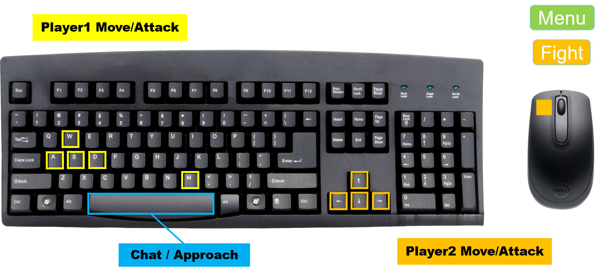
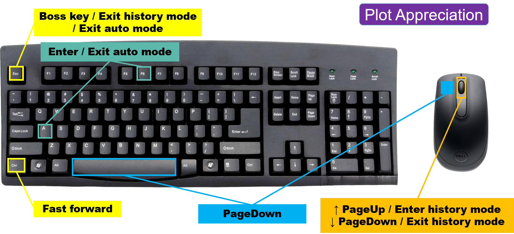

# Readme

The group is called ***Sacabambaspis_aaaaa*** , and the only member is ***aaaaa(周博扬 2024533141)***.

You may access the game in the repository [Sacabambaspis_aaaaa](https://github.com/aaaaa114514-1/Sacabambaspis_aaaaa) .

The name of the game is ***Soul_Knight*** .

#### This is a game similar to the original 'Soul Knight', in terms of both **game-play** and **plot**.

### How to run it ?

- You can use VSCode to open the file and run **main.py** .

- **Do not** attempt to maximize or resize the window.

- Turn your Chinese input method **off** , or you will not be able to play through keyboard any more.

- The current version of the game relies on the following third-party libraries to run:
  - | Library     | Version |
    | ----------- | ------- |
    | openai      | 1.58.1  |
    | pygame-ce   | 2.5.2   |
    | pygame_gui  | 0.6.13  |
    | PyGetWindow | 0.0.9   |

- Note that if you meet some problems when installing pygame-ce, please UNINSTALL pygame AND pygame-ce FIRST and THEN INSTALL pygame-ce. Besides, using virtual environments to avoid version conflicts is also a good idea.

- Also seen in ***requirements.txt*** .

### **How to cheat** ?

- Cheating in this game is **not recommended**. The gaming experience will decrease.
- If you still want to cheat in the game, just run **account_setter.py** and log in with the account **aaaaa** with **empty password** . You will get everything in the game including full likeability with NPCs, 1000 Soulstones and all the weapons and potions. 

### Log in First

- You should log in (or register first, of course) before playing because there are things bound to your account (such as your resources, your chat history with NPCs, and your relationship❤ ).
- You can enter with your username and your password.

### How to play?

- Please check ***Menu&Fight.png*** and ***Plot Appreciation.png*** to learn more about the key mapping:

  

  

- There are different scenes in the whole game:

#### Plot Appreciation

- ~~The interface design is inspired by Galgame.~~

|             **Keys**             | **Functions** |
| :------------------------------: | :-----------: |
| Space / left-click / scroll down |   next page   |
|           Ctrl (left)            | fast forward  |
|              A / F6              |   auto mode   |
|            scroll up             |    history    |
|               Esc                |   Boss key    |

You may encounter a plot appreciation scene when you successfully registered and logged in for the first time. Enjoy it!

You can scroll up to view history, and scroll down to exit history mode, or press **Esc**. Press **A** or **F6** to enter auto mode (2.5s/page), and press them again or **Esc** to exit.

#### Menu

|    **Keys**    |          **Functions**           |
| :------------: | :------------------------------: |
|     W / ↑      |  (Player 1 / Player 2) move up   |
|     S / ↓      | (Player 1 / Player 2) move down  |
|     A / ←      | (Player 1 / Player 2) move left  |
|     D / →      | (Player 1 / Player 2) move right |
| M / Left-click |   (Player 1 / Player 2) attack   |
|     Space      |   Player 1 & Player 2 approach   |
|      Esc       |             Boss key             |

- Menu page locates in a beautiful village ! You can buy different weapons and potions, choose from these weapons and enter the portal to start a battle.
- You will meet NPCs here. You may approach them and press **Space** to talk to them (more details in Part **Chat with NPCs** ). 
- You can play in either **single player mode** and **pair mode** ! Just approach the portal by yourself / together with your friend and press **Space** !
- You can try your weapons here **for free** ! No limit for magic and you won't be defeated !

#### Fight

- You play the role **Soul Knight**, and you can press keys to control him/them to move or attack enemies by shooting.

- Your goal is to defeat the enemies and then approach the portal.
- Everyone has **HP** and **MP** of their own. When one's HP gets down to 0 or below, then he is defeated.
- Shooting consumes magic power (MP). When one's MP cannot afford a single shot, then he cannot shoot anymore.
- You can move towards the edge of the screen to move the map in most cases. If you have reached the edge of the map or the other player is at the opposite edge of the screen, you cannot move the map.
- When a bullet goes outside the screen, it will be removed.
- When you have defeated all enemies and both of you (If someone is defeated or it's a single-player game, then one player is also accepted) are beside the portal, you can press **Space** to enter the portal and win !

- Haven't remember the steps above? Don't worry! After you have defeated all enemies, everything you should do is just to follow the tips in the bottom right corner of the screen.

#### Chat with NPCs

- You can chat with NPCs powered by ollama AI. You can key in the text box below and press **Enter (on keyboard or keypad)** or press the button **Enter** to send a message to him/her.
- You can improve your relationship with him/her by chatting.
- You may get **key information**, **effect gain** or **resources** by talking to NPCs! The closer your relationship is, the more you may get!
- All your relationship and chat history will be saved and bound to your account.
- Tip: sometimes the NPC won't reply instantly, and you may check your network and wait for his/her reply patiently.

#### Other

- You can press any key or click the screen to skip the opening animation.
- In menu page or in a battle, you can press **Esc** to minimize the game window, pause the music and open CET-6 review material ! (Have a try !)
- When you minimize the game window, the background music will automatically pause in most scenes.
- You may see some buttons on the edge of the screen:
  - **Logout** : Press to log out and go to the login page.
  - **Quit** : Press to quit the current scene and return to the previous scene.
  - **Bag** : Press to choose from your weapons. You can click on the weapons or press **A** / **D** and **←** / **→** to select weapons for two players separately. Your potions are showed in blue at the bottom of the child window.
  - **Vol** : Press to show/hide the volume control slider. You can drag the slider to control the volume of background music.

## To figure out more about the game and its **highlights** , you can refer to **Report.pdf** and check **the last page**.
